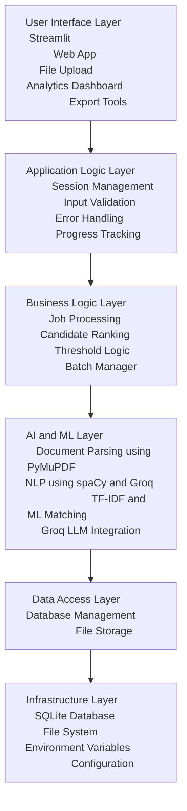

# 🚀 Resume Shortlisting System

An enterprise-grade recruitment automation platform powered by **AI**, **Machine Learning**, and **Large Language Models (LLMs)**. This system automates resume screening with high accuracy and significantly faster processing than manual review.

---

## 📌 Overview

An intelligent resume evaluation tool that uses **Natural Language Processing**, **semantic matching**, and **AI-driven analytics** to help HR teams identify top candidates quickly and effectively.

---

## 🔑 Key Features

- **Multi-format Document Support**: PDF, DOCX, DOC, TXT   
- **AI-Powered Analysis**: Semantic understanding using `spaCy NLP` and `Groq LLM`  
- **Smart Matching Algorithm**: TF-IDF vectorization with cosine similarity scoring  
- **Real-time Analytics**: Interactive dashboards built with Streamlit for insightful visualizations  

---

## 🚀 Quick Start

### ✅ Prerequisites

- Python 3.11+
- 4GB RAM (8GB+ recommended)
- 2GB free disk space

### 🛠️ Installation

```bash
# Clone the repository
git clone https://github.com/your-org/resume-shortlisting-system.git
cd resume-shortlisting-system

# Install dependencies
pip install -r REQUIREMENTS.txt

# Download spaCy NLP model
python -m spacy download en_core_web_sm

# Run the application
streamlit run app.py --server.port 8501
````

---

## ⚡ Enhanced AI Features (Groq LLM)

To enable advanced LLM-based semantic analysis (15–20% improved accuracy):

```bash
# Export your Groq API key
export GROQ_API_KEY=your_groq_api_key
```

---

## 🧠 Usage Instructions

1. **Enter Job Description**: Input the role's requirements and desired qualifications
2. **Upload Resumes**: Upload resume files in batch (PDF/DOCX, up to 25MB each)
3. **Set Threshold**: Adjust similarity score threshold (recommended: 0.3)
4. **Review Results**: Ranked candidates and insights shown in dashboard
5. **Export Data**: Download matching results as a CSV

---

## 🏗️ Technical Architecture

```text
Frontend (Streamlit) → Document Parser (PyMuPDF) → NLP Engine (spaCy/Groq)
                       ↓
Analytics Dashboard ← Database (SQLite) ← Matching Engine (ML/AI)
```

---

## 🧩 Core Components

* **Document Intelligence**: Multi-format resume parsing using PyMuPDF
* **NLP Processing**: Named Entity Recognition, semantic analysis using spaCy/Groq
* **Matching Engine**: TF-IDF vectorization + cosine similarity algorithm
* **Database Layer**: SQLite with support for PostgreSQL migration
* **Security**: File validation, AES-256 encryption, audit logging

---

## 📁 Project Structure

```text
resume-shortlisting-system/
├── app.py                    # Main Streamlit application
├── README.md                 # Project documentation
├── REQUIREMENTS.txt          # Python dependencies
├── pyproject.toml            # Build configuration
├── .env.example              # Environment variable template

├── Core Modules/
│   ├── pdf_parser.py         # Document parsing logic
│   ├── nlp_processor.py      # NLP processing (spaCy, Groq)
│   ├── matching_engine.py    # Matching logic using TF-IDF
│   ├── database.py           # Database operations
│   ├── groq_processor.py     # Optional Groq LLM integration
│   └── utils.py              # Utility functions

├── .streamlit/config.toml    # Streamlit server configuration
└── resume_storage/           # Resume file storage
```

---

## ⚙️ Configuration

### 🔧 .env Example

```env
GROQ_API_KEY=your_groq_api_key
DATABASE_URL=sqlite:///resume_system.db
SIMILARITY_THRESHOLD=0.3
MAX_FILE_SIZE_MB=25
```

### 📡 Manual Production Run

```bash
streamlit run app.py --server.port 8501 --server.address 0.0.0.0
```

---

### 🏗️ System Architecture Overview

<details>
<summary>Click to expand Architecture Diagram (Mermaid)</summary>



</details>


---

### 🗃️ Database Schema Design (ER Diagram)
┌─────────────────────────────────────────────────────────────────────────────┐
│                          DATABASE SCHEMA DESIGN                            │
└─────────────────────────────────────────────────────────────────────────────┘

    ┌──────────────────────────────────┐
    │         JOB_DESCRIPTIONS         │
    ├──────────────────────────────────┤
    │ PK  id (INTEGER)                 │
    │     title (VARCHAR(255))         │
    │     description (TEXT)           │
    │     requirements (TEXT)          │
    │     similarity_threshold (FLOAT) │
    │     created_at (TIMESTAMP)       │
    │     updated_at (TIMESTAMP)       │
    └──────────────────────────────────┘
                     │
                     │ 1:N
                     ▼
    ┌──────────────────────────────────┐
    │           CANDIDATES             │
    ├──────────────────────────────────┤
    │ PK  id (INTEGER)                 │
    │ FK  job_description_id (INTEGER) │
    │     filename (VARCHAR(255))      │
    │     full_name (VARCHAR(255))     │
    │     email (VARCHAR(255))         │
    │     phone (VARCHAR(50))          │
    │     location (VARCHAR(255))      │
    │     experience_years (INTEGER)   │
    │     resume_text (TEXT)           │
    │     similarity_score (DECIMAL)   │
    │     match_status (ENUM)          │
    │     file_size_mb (DECIMAL)       │
    │     file_hash (VARCHAR(64))      │
    │     processed_at (TIMESTAMP)     │
    │     created_at (TIMESTAMP)       │
    └──────────────────────────────────┘
           │                    │
           │ 1:N                │ 1:N
           ▼                    ▼
    ┌─────────────────┐    ┌─────────────────┐
    │   EDUCATION     │    │     SKILLS      │
    ├─────────────────┤    ├─────────────────┤
    │ PK id (INTEGER) │    │ PK id (INTEGER) │
    │ FK candidate_id │    │ FK candidate_id │
    │    degree       │    │    skill        │
    │    institution  │    │    category     │
    │    start_date   │    │    proficiency  │
    │    end_date     │    │    years_exp    │
    │    gpa          │    │    verified     │
    │    major        │    │    source       │
    └─────────────────┘    └─────────────────┘

    ┌──────────────────────────────────┐
    │       MATCHING_SESSIONS          │
    ├──────────────────────────────────┤
    │ PK  id (INTEGER)                 │
    │ FK  job_description_id (INTEGER) │
    │     total_candidates (INTEGER)   │
    │     shortlisted_count (INTEGER)  │
    │     rejected_count (INTEGER)     │
    │     avg_similarity_score (FLOAT) │
    │     processing_time_seconds (INT)│
    │     session_start (TIMESTAMP)    │
    │     session_end (TIMESTAMP)      │
    └──────────────────────────────────┘

    ┌──────────────────────────────────┐
    │         FILE_STORAGE             │
    ├──────────────────────────────────┤
    │ PK  id (INTEGER)                 │
    │ FK  candidate_id (INTEGER)       │
    │     original_filename (VARCHAR)  │
    │     stored_filename (VARCHAR)    │
    │     file_path (VARCHAR)          │
    │     file_type (VARCHAR)          │
    │     file_size_bytes (BIGINT)     │
    │     mime_type (VARCHAR)          │
    │     checksum (VARCHAR)           │
    │     upload_timestamp (TIMESTAMP) │
    │     is_archived (BOOLEAN)        │
    └──────────────────────────────────┘

    ┌──────────────────────────────────┐
    │           AUDIT_LOGS             │
    ├──────────────────────────────────┤
    │ PK  id (INTEGER)                 │
    │     entity_type (VARCHAR)        │
    │     entity_id (INTEGER)          │
    │     action (VARCHAR)             │
    │     old_values (JSON)            │
    │     new_values (JSON)            │
    │     user_session (VARCHAR)       │
    │     ip_address (VARCHAR)         │
    │     timestamp (TIMESTAMP)        │
    └──────────────────────────────────┘

---
